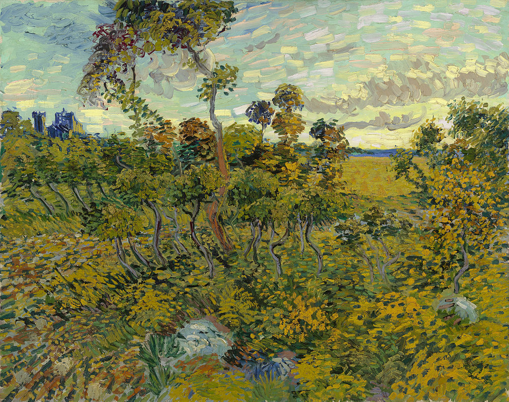

## 15年1月18日，17点

梵高《蒙马儒的日落》

之一

	日落的时候
	总让人觉得更加温暖
	
	温暖的大地
	已经冒起了火苗
	     但是没有烟
	
	烟已经升到了天上
	留下的只有炭火
	
	这是在准备烧烤么？

之二

	太阳在落下前一刻
	终于引燃了大地
	这温情的火苗
	如同小时候
	从灶膛掏出来的未烬的灰
	放入了土盆中笼火
	
	冬天里的人们伸出手
	围绕着温暖的火盆

