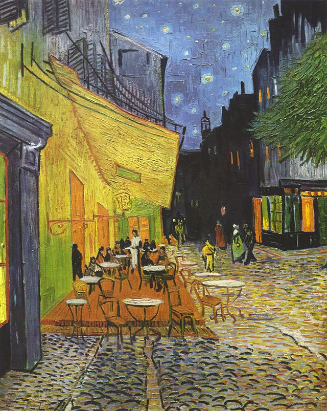

# 15年1月14日，晚

梵高《夜晚露天咖啡座》

解读

	梵高在天空
	煎了一些荷包蛋
	
	侍者在地上
	     放了些盛蛋的托盘
	
	焦急的人们，等着蛋快点煎好
	
	橙红色的地毯，烘托着期盼中的食物

	油灯照得墙壁和顶棚暖暖的
		用来指示煎蛋的落点
	
	疙瘩瘩的地面，是大地的胃
	     她一定会争抢消化天上掉下来的鸡蛋
	
	     （同样要留神被消化的，是我们人类）
