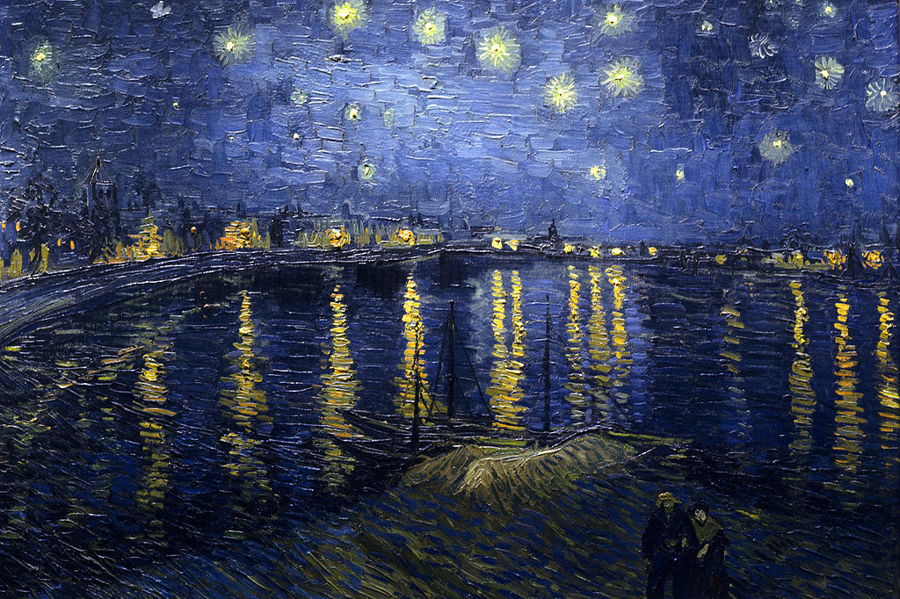

# 15年1月16日早

梵高的《罗纳河上的星夜》

解读

	梵高有超过三十六幅的自画像
		在不同的时间
			不同的城市
		
	这是梵高眼睛的自画像
		但他只画了
			局部
	
	你看
		梵高的眼睛是深蓝色的

	那时，它看见海岸上嫩黄的雏菊
    	还有那海浪堆起的
			飘落的雏菊花瓣
	
	虹膜上
		是教堂的图书室里
			热情的梵高
				高高地把圣经摞在一起					 
					（都快碰到屋顶了）
					柱子一样支撑着他的虹膜

	虹膜上，还有
		未来
			你挽着我，讨论着少年时的情书

	他的瞳孔，是三艘停泊的船

	
梵高有很多自画像
有些年他喜欢画上黄色的草帽
有些年他喜欢画上络腮胡子