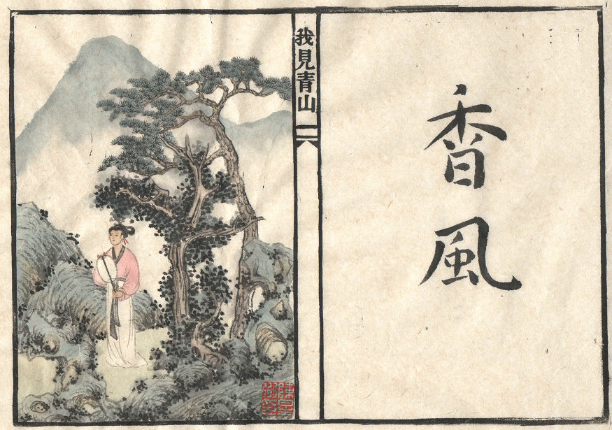

# 15年1月20日

	一个流传下来的故事
	却重复了千年
	
	那个古代的秋天
	我进山去探访少年时的玩伴
	
	青山碧绿
	云汽袅袅
	槐叶稠密
	松腰挺拔
	
	你擒着扇子
	     立在风中
	          风便香了
	
	你不知此刻
	     我屏住呼吸
	          隐在对面山丘的榆树上 
	               望着你
	
	槐树恋着松树
	     松树恋着青山
	我恋着你
	     你念着他
	
	罢了罢了
	既然见了青山
	     我也去恋青山吧
	          青山上飘着香风

