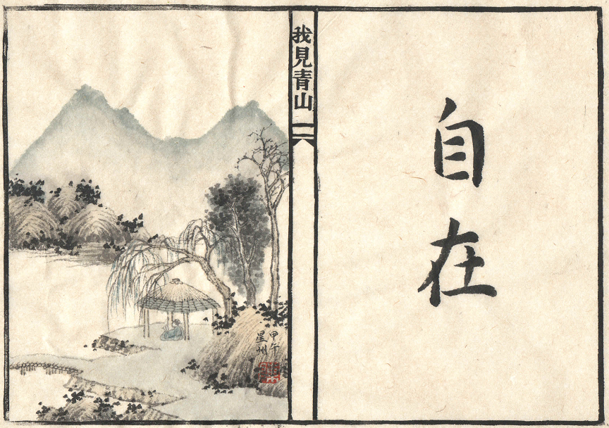

# 15年1月20日

	湖畔的春天
	     垂柳嫩黄
	     白杨鲜绿
	
	一颗古老的枣树
	     感官已有些迟钝
	               迟到的叶子零星的摇着
	
	春风细微
	     鱼儿潜游
	          湖面映着山色，没有涟漪
	
	一座小木桥
	     静悄悄地漂在湖面
	          另一端系在对岸的山脚
	
	我独坐在草亭里
	隔着一潭湖水，默对青山
	     静读一首词......
	
	天籁低微
	     凝神冥想
	          我见青山
	
	我发现自己已在词中
	     "春风自在杨花"
